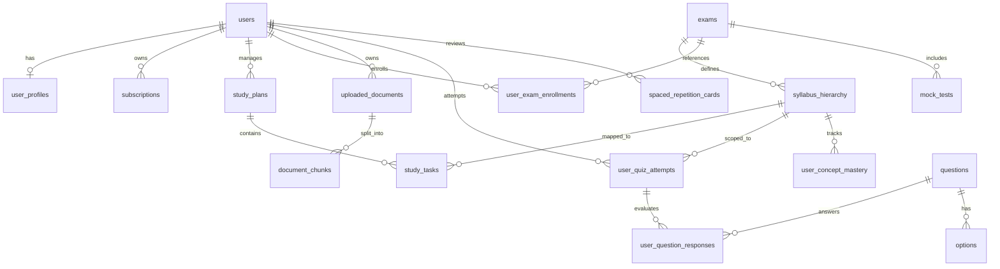

# Tejas — Production Application Architecture

This document provides the complete, production-ready system architecture for **Tejas**, an AI-powered study ecosystem. It acts as the technical blueprint for developing the web and mobile platforms.

---

## 1. System Architecture Overview

```
                                  [ Users ]
                                      │
                 ┌────────────────────┴────────────────────┐
                 ▼                                         ▼
         [ Web Application ]                     [ Mobile Application ]
         (React/Next.js, Tailwind CSS)            (React Native / Flutter)
                 │                                         │
                 └────────────────────┬────────────────────┘
                                      ▼
                           [ HTTPS / WSS Traffic ]
                                      │
                            [ API Gateway / ALB ]
                                      │
           ┌──────────────────────────┼──────────────────────────┐
           ▼                          ▼                          ▼
   [ Core API Services ]     [ AI Gateway / Agent ]     [ Real-time Services ]
   - Auth & Users            - RAG / Chunking Pipeline  - Notification Hub
   - Exam & Syllabus Engine  - Quiz & QA LLM Engine     - WebSocket Event Bus
   - Study Planner Service   - Vector Ingestion Service - Progress Track Engine
   - Payment/Subscription    - Translation/TTS Service
           │                          │                          │
           └──────────────────────────┼──────────────────────────┘
                                      ▼
                              [ Data Layer ]
           ┌──────────────────────────┼──────────────────────────┐
           ▼                          ▼                          ▼
   [ Relational DB ]          [ Vector Database ]        [ Cache & Queue ]
   - PostgreSQL (Master/Repl) - pgvector / Pinecone      - Redis (Sessions, Cache)
   - Core transactional data  - Embedding indexes        - RabbitMQ / Kafka
```

---

## 2. Core Modules

### 2.1 Authentication & Profile Module
*   **Purpose:** Manages secure sign-up, login, multi-factor authentication, and onboarding.
*   **Key Responsibilities:**
    *   OAuth 2.0 integrations (Google, Apple, Passwordless OTP).
    *   User profile collection (target exams, daily hours, current academic level, learning preferences).
    *   Session tracking and device limitation validation (preventing subscription sharing).

### 2.2 Exam & Syllabus Engine
*   **Purpose:** The structured repository of all supported Indian examinations (UPSC, SSC, Banking, Railways, JEE, NEET, GATE, etc.).
*   **Key Responsibilities:**
    *   Hierarchical tree structure: Exam $\rightarrow$ Stage $\rightarrow$ Subject $\rightarrow$ Topic $\rightarrow$ Sub-topic.
    *   Curated roadmap engine mapping historical exam dates to preparation milestones.
    *   Static document repository for Previous Year Papers (PYQs) and official syllabus PDFs.

### 2.3 AI Study Planner Module
*   **Purpose:** Generates and dynamically adjusts personalized schedules based on target exam parameters.
*   **Key Responsibilities:**
    *   Initial generation algorithm using user target date, daily budget hours, and syllabus weightage.
    *   Dynamic rescheduling pipeline: Automatically triggers recalculations when days are missed or performance indicators drop below expectations.

### 2.4 Document & Learning Ingestion Engine
*   **Purpose:** Handles user-provided academic materials (PDFs, text files, web URLs, YouTube links).
*   **Key Responsibilities:**
    *   Document extraction and OCR pipeline.
    *   YouTube transcript fetcher and cleaner.
    *   Document chunking, metadata extraction, and vector embedding generator.

### 2.5 Quiz & Mock Test Engine
*   **Purpose:** Facilitates user testing via dynamic AI-generated quizzes or standardized mocks.
*   **Key Responsibilities:**
    *   Dynamic query assembly for Vector DB (RAG) based on selected topic or uploaded document.
    *   On-the-fly LLM question generation (JSON schema validation) for Multiple-Choice, True/False, and Fill-in-the-blanks.
    *   Timed mock testing console mimicking actual exam constraints (especially for government exams).

### 2.6 Spaced Repetition Revision Vault
*   **Purpose:** Retains weak and forgotten items using adaptive spaced retrieval schedules.
*   **Key Responsibilities:**
    *   Spaced repetition calculator (SuperMemo-2 / FSRS adaptation).
    *   "Daily Revision Queue" aggregator pulling due flashcards and flagged incorrect questions.

### 2.7 Learner Analytics Engine
*   **Purpose:** Measures concept mastery, velocity, accuracy, and maps predictive outcomes.
*   **Key Responsibilities:**
    *   Calculates moving averages for accuracy at subject, topic, and sub-topic levels.
    *   Concept Mastery Index (CMI) mapping logic (Critical $\rightarrow$ Mastered).
    *   Rank and percentile forecasting relative to active user cohorts.

### 2.8 Subscription & Monetization Module
*   **Purpose:** Controls tier access, daily token limits, and gateways.
*   **Key Responsibilities:**
    *   Razorpay (India-focused local UPI/net-banking) and Stripe payment integrations.
    *   Dynamic quota/rate-limiter checking daily prompt allocations.

---

## 3. Pages & UI Navigation Structure

```
[ App Shell / Navigation Layout ]
  ├── (Private Navigation)
  │     ├── Dashboard (Overview, Daily Tasks, Mastery Map, Streaks)
  │     ├── Exam Explorer (Exams, Roadmaps, PYQ Vault)
  │     ├── Academic Hub (Subject Trees, Document/YouTube Uploader)
  │     ├── AI Study Planner (Calendar View, Rescheduling Center)
  │     ├── Practice Center
  │     │     ├── Dynamic Quiz Generator (Topic selection, Document selector, Difficulty config)
  │     │     ├── Mock Test Lounge (Active testing screen, Split-screen PYQ, Mock analysis report)
  │     │     └── Revision Vault (Spaced repetition queue, Flashcard deck review)
  │     ├── Analytics Center (Mastery breakdown, Strength charts, Predicted Score details)
  │     └── Profile & Settings (Billing, Daily target configurator, Linked logins)
  └── (Admin Navigation)
        └── Console (DAU metrics, Subscription health, System health, System-wide prompt manager)
```

---

## 4. User Flows

### Flow A: Government Exam Aspirant Onboarding & Prep
```
[User Registers] ──► [Selects Target Exam (e.g. UPSC)] ──► [Inputs Available Hours & Exam Date]
                          │
                          ▼
       [AI Study Planner generates dynamic roadmap]
                          │
                          ▼
         [User views Dashboard Tasks for the day]
                          │
       ┌──────────────────┴──────────────────┐
       ▼                                     ▼
[Reads Study Material/Syllabus]      [Attempts Target Quiz / Mock]
       │                                     │
       ▼                                     ▼
[Tracks Topic Mastery (Analytics)] ◄── [Saves incorrect items to Revision Vault]
```

### Flow B: Ingestion-to-Assessment (Academic / Professional)
```
[Uploads Textbook PDF or YouTube URL] ──► [Background Worker processes, chunks, & embeds text]
                                                    │
                                                    ▼
                                    [AI generates Summary & Key Concepts]
                                                    │
                                                    ▼
                                    [User starts Quiz Generation screen]
                                                    │
                                                    ▼
                                    [User answers dynamically generated MCQs]
                                                    │
                                                    ▼
                                  [Detailed explanations rendered per option]
```

### Flow C: Adaptive Spaced Repetition Revision
```
[User opens Revision Tab] ──► [Retrieves due cards calculated via FSRS/SM-2 algorithm]
                                       │
                                       ▼
                         [Attempts card / incorrect question]
                                       │
                        ┌──────────────┴──────────────┐
                        ▼                             ▼
                  [Answer Correct]             [Answer Incorrect]
                        │                             │
                        ▼                             ▼
            [Next review gap increased]   [Next review gap set to immediate]
```

---

## 5. Database Schema (Entities & Relationships)



### 5.1 Relational Core Entities (PostgreSQL dialect DDL abstraction)

#### `users`
*   `id` (UUID, Primary Key)
*   `email` (VARCHAR, Unique, Indexed)
*   `password_hash` (VARCHAR, Nullable for OAuth)
*   `created_at` (TIMESTAMP)
*   `updated_at` (TIMESTAMP)
*   `is_active` (BOOLEAN)

#### `user_profiles`
*   `user_id` (UUID, Foreign Key $\rightarrow$ `users.id`, Unique)
*   `full_name` (VARCHAR)
*   `avatar_url` (VARCHAR)
*   `onboarding_completed` (BOOLEAN)
*   `daily_study_goal_minutes` (INTEGER)
*   `preferred_language` (VARCHAR)

#### `exams`
*   `id` (UUID, Primary Key)
*   `name` (VARCHAR, Unique)
*   `category` (VARCHAR, e.g., 'Government', 'Academic')
*   `conducting_body` (VARCHAR)
*   `target_date` (DATE)
*   `syllabus_structure` (JSONB)

#### `syllabus_hierarchy`
*   `id` (UUID, Primary Key)
*   `exam_id` (UUID, Foreign key $\rightarrow$ `exams.id`)
*   `parent_node_id` (UUID, Self-referencing Foreign Key for nested topics)
*   `title` (VARCHAR)
*   `weightage_percentage` (NUMERIC)
*   `depth_level` (INTEGER)

#### `user_exam_enrollments`
*   `id` (UUID, Primary key)
*   `user_id` (UUID, Foreign key $\rightarrow$ `users.id`)
*   `exam_id` (UUID, Foreign key $\rightarrow$ `exams.id`)
*   `enrolled_at` (TIMESTAMP)
*   `is_primary` (BOOLEAN)

#### `study_plans`
*   `id` (UUID, Primary Key)
*   `user_id` (UUID, Foreign Key $\rightarrow$ `users.id`)
*   `exam_id` (UUID, Foreign Key $\rightarrow$ `exams.id`)
*   `start_date` (DATE)
*   `end_date` (DATE)
*   `status` (VARCHAR)

#### `study_tasks`
*   `id` (UUID, Primary Key)
*   `plan_id` (UUID, Foreign Key $\rightarrow$ `study_plans.id`)
*   `topic_id` (UUID, Foreign Key $\rightarrow$ `syllabus_hierarchy.id`)
*   `scheduled_date` (DATE)
*   `time_block_minutes` (INTEGER)
*   `is_completed` (BOOLEAN)
*   `completed_at` (TIMESTAMP)

#### `uploaded_documents`
*   `id` (UUID, Primary Key)
*   `user_id` (UUID, Foreign Key $\rightarrow$ `users.id`)
*   `title` (VARCHAR)
*   `file_url` (VARCHAR)
*   `source_type` (VARCHAR, 'pdf', 'youtube', 'text')
*   `status` (VARCHAR, 'processing', 'completed', 'failed')
*   `vector_namespace` (VARCHAR)
*   `created_at` (TIMESTAMP)

#### `document_chunks`
*   `id` (UUID, Primary Key)
*   `document_id` (UUID, Foreign Key $\rightarrow$ `uploaded_documents.id`)
*   `chunk_index` (INTEGER)
*   `text_content` (TEXT)
*   `token_count` (INTEGER)

#### `questions`
*   `id` (UUID, Primary Key)
*   `source_id` (UUID, Nullable, references document/topic/exam)
*   `source_type` (VARCHAR, 'ai_doc', 'ai_topic', 'pyq', 'mock')
*   `question_text` (TEXT)
*   `question_type` (VARCHAR, 'mcq', 'true_false', 'fill_in_the_blank')
*   `difficulty_level` (VARCHAR, 'easy', 'medium', 'hard')
*   `explanation` (TEXT)
*   `created_at` (TIMESTAMP)

#### `options`
*   `id` (UUID, Primary Key)
*   `question_id` (UUID, Foreign Key $\rightarrow$ `questions.id`)
*   `option_text` (TEXT)
*   `is_correct` (BOOLEAN)

#### `user_quiz_attempts`
*   `id` (UUID, Primary Key)
*   `user_id` (UUID, Foreign Key $\rightarrow$ `users.id`)
*   `scoped_type` (VARCHAR, 'syllabus_topic', 'document')
*   `scoped_id` (UUID, target topic_id or document_id)
*   `started_at` (TIMESTAMP)
*   `completed_at` (TIMESTAMP)
*   `overall_score` (NUMERIC)

#### `user_question_responses`
*   `id` (UUID, Primary Key)
*   `attempt_id` (UUID, Foreign Key $\rightarrow$ `user_quiz_attempts.id`)
*   `question_id` (UUID, Foreign Key $\rightarrow$ `questions.id`)
*   `selected_option_id` (UUID, Foreign Key $\rightarrow$ `options.id`, Nullable)
*   `response_text` (TEXT, Nullable)
*   `is_correct` (BOOLEAN)
*   `time_taken_seconds` (INTEGER)
*   `confidence_level` (INTEGER, 1 to 5)

#### `spaced_repetition_cards`
*   `id` (UUID, Primary Key)
*   `user_id` (UUID, Foreign Key $\rightarrow$ `users.id`)
*   `question_id` (UUID, Foreign key $\rightarrow$ `questions.id`, Nullable)
*   `front_text` (TEXT)
*   `back_text` (TEXT)
*   `interval_days` (NUMERIC)
*   `ease_factor` (NUMERIC)
*   `repetition_count` (INTEGER)
*   `next_review_due` (TIMESTAMP)

#### `user_concept_mastery`
*   `id` (UUID, Primary Key)
*   `user_id` (UUID, Foreign Key $\rightarrow$ `users.id`)
*   `topic_id` (UUID, Foreign Key $\rightarrow$ `syllabus_hierarchy.id`)
*   `mastery_score` (NUMERIC)
*   `last_evaluated` (TIMESTAMP)

#### `subscriptions`
*   `id` (UUID, Primary Key)
*   `user_id` (UUID, Foreign Key $\rightarrow$ `users.id`)
*   `plan_type` (VARCHAR, 'free', 'basic_premium', 'unlimited_elite')
*   `status` (VARCHAR, 'active', 'cancelled', 'expired')
*   `billing_cycle_start` (TIMESTAMP)
*   `billing_cycle_end` (TIMESTAMP)

---

## 6. AI Ingestion, Processing & Generation Engine

The AI Intelligence layer is split into distinct functional engines, each operating with specific models, prompts, and pipeline orchestrations.

```
       [ Input Raw File ] ──► [ Text Extraction & OCR ] ──► [ Recursive Text Splitter ]
                                                                      │
                                                                      ▼
       [ Pinecone / pgvector ] ◄── [ Embedding Model ] ◄── [ Semantic Chunk Overlap ]
                 │
                 ▼
       [ Prompt Templates & Context assembly ]
                 │
                 ▼
[ JSON Enforced LLM Call ] ──► [ Answer / Quiz generation & Verification ]
```

### 6.1 Text Ingestion & Embedding Pipeline
*   **Chunking Strategy:** Semantic Chunking with a chunk size of 1000 tokens and 150-token recursive overlap to prevent contextual loss at boundaries.
*   **Embedding Model:** `text-embedding-3-small` (1536 dimensions) for optimized retrieval performance.
*   **Vector Database Strategy:** Isolated namespaces in Vector DB partitioned at the `user_id` and `document_id` levels.

### 6.2 Quiz Generation Prompt & Verification Pipeline
To guarantee stable production outputs, the generation loop enforces structured JSON outputs.

#### Quiz Schema Constraints
```json
{
  "$schema": "http://json-schema.org/draft-07/schema#",
  "title": "QuizSet",
  "type": "object",
  "properties": {
    "quizzes": {
      "type": "array",
      "items": {
        "type": "object",
        "properties": {
          "question_text": { "type": "string" },
          "question_type": { "type": "string", "enum": ["mcq", "true_false"] },
          "options": {
            "type": "array",
            "items": {
              "type": "object",
              "properties": {
                "option_text": { "type": "string" },
                "is_correct": { "type": "boolean" }
              },
              "required": ["option_text", "is_correct"]
            },
            "minItems": 2,
            "maxItems": 4
          },
          "explanation": { "type": "string" }
        },
        "required": ["question_text", "question_type", "options", "explanation"]
      }
    }
  },
  "required": ["quizzes"]
}
```

*   **Self-Correction Loop:** Validates the schema client-side post-generation. If JSON parsing fails or schema validation fails, a single retry execution is requested from the model with explicit parsing validation feedback.

### 6.3 Weak Topic Detection & Mastery Scoring Model
*   **Calculation Method:** Weighted moving average of last 10 quiz attempts for the target concept.
$$\text{Mastery Score} = \sum_{i=1}^{n} w_i \times x_i$$
Where $x_i$ is correctness ($0$ or $1$), and weight $w_i$ decays exponentially based on temporal distance ($w_n$ represents the most recent response).
*   **Trigger Thresholds:** If mastery score drops below 50% on a sub-topic:
    1. An inline alert is generated.
    2. Recommended resource items are selected.
    3. The concept is inserted into the immediate revision vault priority loop.

---

## 7. API Architecture & Routing Contracts

The gateway uses clean REST naming schemes, with WebSocket triggers for asynchronous jobs (e.g. background document parsing).

### 7.1 REST Route Contracts

#### 🔐 Authentication & Onboarding
*   `POST /api/v1/auth/signup` $\rightarrow$ Registers new users.
*   `POST /api/v1/auth/login` $\rightarrow$ Verifies passwords/tokens and returns JWT.
*   `POST /api/v1/profile/onboard` $\rightarrow$ Updates initial parameters.

#### 📚 Syllabus & Exam Engine
*   `GET /api/v1/exams` $\rightarrow$ Searchable database list of supported competitive exams.
*   `GET /api/v1/exams/:id/syllabus` $\rightarrow$ Returns syllabus node trees.
*   `GET /api/v1/exams/:id/roadmaps` $\rightarrow$ Retrieves system-generated target milestones.

#### 📅 Study Planner Engine
*   `POST /api/v1/plans/generate` $\rightarrow$ Creates new study plans.
*   `GET /api/v1/plans/current` $\rightarrow$ Gets current daily tasks.
*   `POST /api/v1/plans/reschedule` $\rightarrow$ Triggers rebalancing calculations.

#### 📝 Document Ingestion & Vector Pipeline
*   `POST /api/v1/documents/upload` $\rightarrow$ Initiates pre-signed S3 URL request for source uploads.
*   `POST /api/v1/documents/:id/process` $\rightarrow$ Dispatches chunking, parsing, and vector ingestion jobs.
*   `GET /api/v1/documents/:id/status` $\rightarrow$ Checks background job processing status.

#### 🎯 Quiz & Mock Engine
*   `POST /api/v1/quizzes/generate/topic` $\rightarrow$ Generates quizzes based on syllabus nodes.
*   `POST /api/v1/quizzes/generate/document` $\rightarrow$ Generates quizzes based on uploaded documents.
*   `POST /api/v1/quizzes/submit` $\rightarrow$ Submits completed attempt answers.

#### 📊 Analytics & Reporting
*   `GET /api/v1/analytics/mastery` $\rightarrow$ Summarizes user concept mastery levels.
*   `GET /api/v1/analytics/weak-areas` $\rightarrow$ Returns flagged topics.

---

## 8. Role-Based Access Control (RBAC) Matrix

We enforce strict separation of duties and features using authorization middleware at the route level.

| Resource/Action | Free Learner | Premium Learner | Institution Admin | SuperAdmin |
|---|---|---|---|---|
| Read Syllabus & Exams | ✅ | ✅ | ✅ | ✅ |
| Upload Personal Docs | ❌ (View Only) | ✅ (Unlimited) | ✅ (Org Scope) | ✅ |
| Generate Daily AI Quiz | ✅ (Limit: 3/day) | ✅ (Unlimited) | ✅ (Unlimited) | ✅ |
| Attempt Standardized Mock | ✅ (Basic) | ✅ (Full Access) | ✅ (Full Access) | ✅ |
| Custom Organizational Mock | ❌ | ❌ | ✅ (Create/Assign) | ✅ |
| View Personal Analytics | ✅ | ✅ | ✅ | ✅ |
| View Cohort/Class Analytics | ❌ | ❌ | ✅ (Class Scope) | ✅ |
| Modify Master Exam Lists | ❌ | ❌ | ❌ | ✅ |
| Configure System Prompt Templates | ❌ | ❌ | ❌ | ✅ |

---

## 9. Future-Proof Expansion Architecture

To ensure Tejas scales efficiently, we isolate experimental and roadmap features behind flexible integration APIs:

1.  **Multi-Lingual Localization Adapter:** A middleware layer in the API gateway translates standard UI messages. LLM requests pass through a translation prompt interface before generation to output regional Indian languages (Hindi, Tamil, Telugu, etc.).
2.  **Voice-Based Conversational Q&A:** A dedicated WebRTC gateway converts user audio to text (Whisper/Gemini Audio API), routes it to the chat engine, and returns a TTS stream.
3.  **Institutional B2B SaaS Tenancy:** A tenant mapping layer in the database splits organization data, enabling schools and coaching classes to manage custom syllabus structures, student tracking dashboards, and invite-only assignments.
4.  **Offline Database Synchronizer:** An indexed DB architecture in the client browser caches syllabus structures and daily flashcards. Service workers queue quiz responses offline and push sync payloads to the gateway when connections are re-established.
